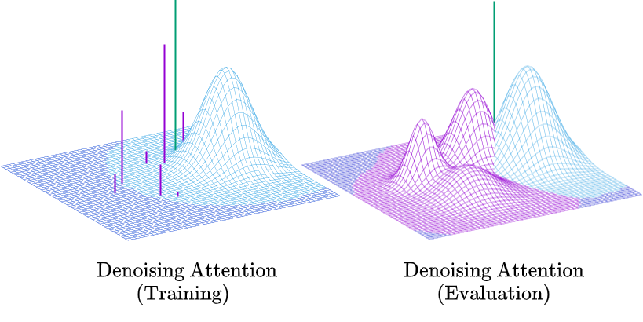

..
.. SPDX-FileCopyrightText: Copyright © 2023 Idiap Research Institute <contact@idiap.ch>
..
.. SPDX-FileContributor: Fabio J Fehr <fabio.fehr@idiap.ch>
..
.. SPDX-License-Identifier: GPL-3.0-only
..

================================================================================================================
Nonparametric Variational Information Bottleneck (NVIB)
================================================================================================================

[Paper1_][Paper2_]

The NVIB Python package containing the NVIB layer and the Denoising attention module. This is the package for the papers:

- `A Variational AutoEncoder for Transformers with Nonparametric Variational Information Bottleneck <https://openreview.net/forum?id=6QkjC_cs03X>`_
- `Learning to Abstract with Nonparametric Variational Information Bottleneck <https://openreview.net/forum?id=vU0KbvQ91x>`_

Please cite the original authors for their work in any publication(s) that uses this work:

.. code:: bib

    @inproceedings{henderson23_nvib,
    author    = {James Henderson and Fabio Fehr},
    title     = {{A VAE for Transformers with Nonparametric Variational Information Bottleneck}},
    year      = {2023},
    booktitle = {International Conference on Learning Representations},
    url={https://openreview.net/forum?id=6QkjC_cs03X}
    }

    @inproceedings{behjati2023learning,
    title={Learning to Abstract with Nonparametric Variational Information Bottleneck},
    author={Melika Behjati and Fabio James Fehr and James Henderson},
    booktitle={The 2023 Conference on Empirical Methods in Natural Language Processing},
    year={2023},
    url={https://openreview.net/forum?id=vU0KbvQ91x}
    }

Description
------------

The NVIB project containing the NVIB layer and the Denoising attention module.

Requirements
-------------

- Python 3.9
- PyTorch 2.0.0
- math 

Installation
------------

Clone this repository.  Activate your environment and install this package locally into your environment:

.. code:: bash

    git clone https://gitlab.idiap.ch/ffehr/nvib.git
    pip install nvib/.

Project status
----------------

V2 Improvements:

- Implicit reparamerisation gradients
- KL divergence functions are methods of the NVIB layer class
- Update to Pytorch 2.0.0

Development is ongoing and soon to have implementations for: 

- Denoising attention for multihead attention
- Initialisations

Python Usage
-------------------

Import the package and its components

.. code:: python

    from nvib.nvib_layer import Nvib
    from nvib.denoising_attention import DenoisingMultiheadAttention

For running the following examples:

.. code:: python 

    # For examples
    import torch 
    import torch.nn as nn 

    Ns, Nt, B, H = 10, 6, 2, 512
    number_samples = 3
    encoder_output = torch.rand(Ns,B,H)
    src_key_padding_mask = torch.zeros((B,Ns),dtype=bool)
    tgt = torch.rand(Nt,B,H)
    tgt_key_padding_mask = torch.zeros((B,Nt),dtype=bool)
    memory_key_padding_mask = torch.zeros((number_samples,Ns),dtype=bool)
    device = "cpu"

Nonparametric Variational Information Bottleneck
~~~~~~~~~~~~~~~~~~~~~~~~~~~~~~~~~~~~~~~~~~~~~~~~~

Initialise the NVIB layer (Source length = :math:`N_s`, embedding size = :math:`H`, Batch size = :math:`B`).

- `size_in` The embedding size input
- `size_out` The embedding size output (typically the same)
- `prior_mu` Torch tensor of size_in Prior for Gaussian means :math:`\mu^p` if None then :math:`\mu^p = 0`
- `prior_var` Torch tensor of size_in  Prior for Gaussian variance :math:`(\sigma^2)^p` if None then :math:`(\sigma^2)^p = 1`
- `prior_alpha` Torch tensor of 1 Prior for Dirichlet psuedo-counts :math:`\alpha_0^p` if None then :math:`\alpha_0^p = 1`
- `delta` Conditional prior :math:`\alpha^\Delta` - Proportion of vectors you would like to retain 
- `kappa` Number of samples per component :math:`\kappa^\Delta`

**Note:** The output size in training will always be :math:`(N_s+1) \times \kappa^\Delta` as it includes the prior :math:`(+1)` and does
:math:`\kappa^\Delta` samples in training. At evaluation time we only use the means and thus only :math:`N_s+1`.

.. code:: python

    nvib_layer = Nvib(size_in=H,
                  size_out=H,
                  prior_mu=None,
                  prior_var=None,
                  prior_alpha=None,
                  delta=1,
                  kappa=1)

Run the forward of the layer with encoder_output size :math:`(N_s, B, H)` and boolean mask size :math:`(B, N_s)` where True masks the
token.

.. code:: python

    latent_dict = nvib_layer(encoder_output, src_key_padding_mask, alpha_skip=None)

The alpha_skip input can be used to pass the previous layers `alpha`. The dictionary returned is of the form:

`{z,pi,memory_key_padding_mask,mu,logvar,alpha}`

where `z` is a tuple containing `(z, pi, mu, logvar)` variables. This tuple is what is passed to
the `DenoisingMultiheadAttention` forward function such that it may access the parameters.

- The `z` within the tuple is the Gaussian component vectors. :math:`((N_s+1) \times \kappa^\Delta, B, H)`
- `alpha` is the psuedo-counts. :math:`((N_s+1) \times \kappa^\Delta, B, 1)`
- `pi` is the Dirichlet probability reparameterised from psuedo-counts :math:`((N_s+1) \times \kappa^\Delta, B, 1)`
- `mu` is the means of the Gaussian components. :math:`((N_s+1) \times \kappa^\Delta, B, H)`
- `logvar` is the logged variance of the Gaussian components. :math:`((N_s+1) \times \kappa^\Delta, B, H)`
- `memory_key_padding_mask` is the encoders boolean attention mask. :math:`(B, (N_s+1) \times \kappa^\Delta)`
- `avg_num_vec` is the number of non-zero psuedo-counts averaged over the batch (used for logging)
- `avg_prop_vec` is the proportion of non-zero psuedo-counts averaged over the batch (used for logging)
- `avg_alpha0` is the sum of psuedo-counts used averaged over the batch (used for logging)

sampling can be done as follows with integer number_samples (seen as a batch size) and boolean mask size :math:`(B, N_s)` where
True masks the token.
This mask is made with :math:`N_s` being the largest size you wish to sample and lengths can predetermined by the user.

.. code:: python

    z = nvib_layer.sample(number_samples, memory_key_padding_mask, device)

Denoising Attention
---------------------

This duplicates and augments the `multi_head_attention_forward` function and `multi_head_attention` class from Pytorch.

Initialise the Transformer decoder: **Note:** nhead = 1

.. code:: python

    decoder_layer = nn.TransformerDecoderLayer(d_model=H,
                                            dim_feedforward=4*H,
                                            nhead=1,
                                            dropout=0.1)

    transformer_decoder = nn.TransformerDecoder(decoder_layer,
                                                num_layers=1)

Set each layer which interfaces encoder and decoder to Denoising Attention:

.. code:: python

    for layer_num, layer in enumerate(transformer_decoder.layers):
        layer.multihead_attn = DenoisingMultiheadAttention(embed_dim=H,
                                                        num_heads=1,
                                                        dropout=0.1,
                                                        bias=False)

Now the forward for this decoder: **Note:** It assumes keys and values from the encoder output are a
tuple `(z, pi, mu, logvar)` where the `z` within the tuple was the original input.

.. code:: python

    
    output = transformer_decoder(tgt=tgt,
                                memory=latent_dict["z"],
                                tgt_key_padding_mask=tgt_key_padding_mask,
                                memory_key_padding_mask=latent_dict["memory_key_padding_mask"])

KL functions
--------------

Simple implementation for KL divergence between univariate Gaussians tensors augmented with weights from our
psuedo-counts :math:`\alpha` (see paper for more details).

.. code:: python

    kl_g = nvib_layer.kl_gaussian(**latent_dict)

where `mu`, `logvar`, `alpha` and the `memory_key_padding_mask` come from NVIB layer latent dict and priors and number of 
samples :math:`\kappa^\Delta` are set. The output is a KL loss of  dimension (B).

The KL divergence between Dirichlet components (see paper for more details).

.. code:: python

    kl_d = nvib_layer.kl_dirichlet(**latent_dict)

where `alpha` and the `memory_key_padding_mask` come from NVIB layer latent dict and priors and number of 
samples :math:`\kappa^\Delta` are set. The output is a KL loss of dimension (B).

Repository Structure
-----------------------------

.. code:: bash

    .
    ├── nvib
    │   ├── __init__.py
    │   ├── denoising_attention.py
    │   └── nvib_layer.py
    ├── README.rst
    └── setup.py

Contact
---------
For questions or reporting issues to this software package, kindly contact the author_.

.. _author: fabio.fehr@idiap.ch
.. _Paper1: https://openreview.net/forum?id=6QkjC_cs03X
.. _Paper2: https://arxiv.org/abs/2310.17284
