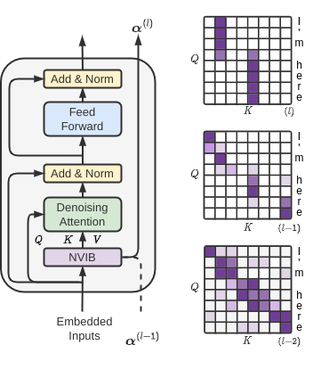

..
.. SPDX-FileCopyrightText: Copyright © 2023 Idiap Research Institute <contact@idiap.ch>
..
.. SPDX-FileContributor: Fabio J Fehr <fabio.fehr@idiap.ch>
..
.. SPDX-License-Identifier: GPL-3.0-only
..

================================================================================================================
Nonparametric Variational Information Bottleneck (NVIB)
================================================================================================================

.. image:: figures/nvib_denoising.png

The NVIB Python package containing the NVIB layer and the Denoising attention module. This is the package for the papers:

- [Tag v1.0] `A Variational AutoEncoder for Transformers with Nonparametric Variational Information Bottleneck <https://openreview.net/forum?id=6QkjC_cs03X>`_
- [Tag v2.0] `Learning to Abstract with Nonparametric Variational Information Bottleneck <https://openreview.net/forum?id=vU0KbvQ91x>`_
- [Tag v3.0] `Nonparametric Variational Regularisation of Pretrained Transformers <https://openreview.net/forum?id=Zu8OWNUC0u#discussion>`_

Please cite the original authors for their work in any publication(s) that uses this work:

.. code:: bib

    @inproceedings{henderson23_nvib,
    author    = {James Henderson and Fabio Fehr},
    title     = {{A VAE for Transformers with Nonparametric Variational Information Bottleneck}},
    year      = {2023},
    booktitle = {International Conference on Learning Representations},
    url={https://openreview.net/forum?id=6QkjC_cs03X}
    }

    @inproceedings{behjati2023learning,
    title={Learning to Abstract with Nonparametric Variational Information Bottleneck},
    author={Melika Behjati and Fabio James Fehr and James Henderson},
    booktitle={The 2023 Conference on Empirical Methods in Natural Language Processing},
    year={2023},
    url={https://openreview.net/forum?id=vU0KbvQ91x}
    }

    @inproceedings{fehr2024nonparametric,
    title={Nonparametric Variational Regularisation of Pretrained Transformers},
    author={Fabio James Fehr and James Henderson},
    booktitle={First Conference on Language Modeling},
    year={2024},
    url={https://openreview.net/forum?id=Zu8OWNUC0u}
    }

Description
------------

The NVIB project containing the NVIB layer and the Denoising attention functions for training and evaluation time.

Requirements
-------------

- Python 3.10
- PyTorch 2.0.0
- pytest

Installation
------------

Clone this repository.  Activate your environment and install this package locally into your environment:

.. code:: bash

    git clone https://gitlab.idiap.ch/ffehr/nvib.git
    pip install nvib/.

Or use the environment.yml file to create a new conda environment

.. code:: bash

    conda env create -f environment.yml
    conda activate nvib

Testing
----------------

We test that NVIB layer and the Denoising attention functions are equivalent to scaled dot product 
attention.

To run the tests, run the following command:

.. code:: bash

    pytest

Project status
----------------

Development is ongoing and soon to have implementations for: 

- Causal self attention
- FlashAttention (HazyResearch)
- Memory-Efficient Attention (xFormers)
- Native C++ implementation

Python Usage
-------------------

Import the package and its components

.. code:: python

    from nvib.nvib_layer import Nvib

For running the following examples:

.. code:: python 

    # For examples
    import torch 
    import torch.nn as nn 
    torch.manual_seed(42)

    Ns, Nt, B, P, nheads = 10, 6, 2, 512, 8
    number_samples = 3
    encoder_output = torch.rand(Ns,B,P)
    src_key_padding_mask = torch.zeros((B,Ns),dtype=bool)
    tgt = torch.rand(Nt,B,P)
    tgt_key_padding_mask = torch.zeros((B,Nt),dtype=bool)
    memory_key_padding_mask = torch.zeros((number_samples,Ns),dtype=bool)
    device = "cpu"

Nonparametric Variational Information Bottleneck
-------------------------------------------------

Initialise the NVIB layer (Source length = :math:`N_s`, embedding size = :math:`P`, Batch size = :math:`B`).

- `size_in` The embedding size input
- `size_out` The embedding size output (typically the same)
- `prior_mu` Prior for Gaussian means :math:`\mu^p`
- `prior_var` Prior for Gaussian variance :math:`(\sigma^2)^p`
- `prior_alpha` Prior for Dirichlet psuedo-counts :math:`\alpha_0^p`
- `delta` Conditional prior :math:`\alpha^\Delta` - Proportion alpha0 you regularise towards 0 is no conidtional prior or :math:`\delta` >0 is the prior 
- `kappa` Number of samples per component :math:`\kappa^\Delta`
- `nheads` Number of heads for the attention module
- `alpha_tau` Temperature parameter for the Dirichlet distribution where 0 is the posterior and 1 is the prior
- `stdev_tau` Temperature parameter for the Gaussian standard deviation where 0 is the posterior and 1 is the prior
- `mu_tau` Temperature parameter for the Gaussian mean where 0 is the posterior and 1 is the prior

**Note:** The output size in training will always be :math:`(N_s+1) \times \kappa^\Delta` as it includes the prior :math:`(+1)` and does
:math:`\kappa^\Delta` samples in training. At evaluation time we only use the means and thus only :math:`N_s+1`.

.. code:: python

    nvib_layer = Nvib(size_in=P,
                  size_out=P,
                  prior_mu=None,
                  prior_var=None,
                  prior_alpha=None,
                  delta=1,
                  kappa=1,
                  nheads=nheads,
                  alpha_tau=None,
                  stdev_tau=None,
                  mu_tau=None,
                  )

Run the forward of the layer with encoder_output size :math:`(N_s, B, P)` and boolean mask size :math:`(B, N_s)` where True masks the
token. In self-attention layers we could include the `alpha_skip` parameter which accumulates the :math:`\alpha` from the previous layer

.. code:: python
    
    # Initial layer
    latent_dict_0 = nvib_layer(encoder_output, src_key_padding_mask, alpha_skip=None)

    # Subsequent layers
    latent_dict_1 = nvib_layer(encoder_output, src_key_padding_mask, alpha_skip=latent_dict_0['alpha'])

The dictionary returned is of the form:

`{z,pi,memory_key_padding_mask,mu,logvar,alpha, avg_num_vec, avg_prop_vec, avg_alpha0}`

where `z` is a tuple containing `(z, pi, mu, logvar)` variables. This tuple is what is passed to
the `DenoisingMultiheadAttention` forward function such that it may access the parameters.

- The `z` within the tuple is the Gaussian component vectors. :math:`((N_s+1) \times \kappa^\Delta, B, P)`
- `alpha` is the psuedo-counts. :math:`((N_s+1) \times \kappa^\Delta, B, 1)`
- `pi` is the Dirichlet probability reparameterised from psuedo-counts :math:`((N_s+1) \times \kappa^\Delta, B, 1)`
- `mu` is the means of the Gaussian components. :math:`((N_s+1) \times \kappa^\Delta, B, P)`
- `logvar` is the logged variance of the Gaussian components. :math:`((N_s+1) \times \kappa^\Delta, B, P)`
- `memory_key_padding_mask` is the encoders boolean attention mask. :math:`(B, (N_s+1) \times \kappa^\Delta)`
- `avg_num_vec` is the number of non-zero psuedo-counts averaged over the batch (used for logging)
- `avg_prop_vec` is the proportion of non-zero psuedo-counts averaged over the batch (used for logging)
- `avg_alpha0` is the sum of psuedo-counts used averaged over the batch (used for logging)

sampling can be done as follows with integer `number_samples` (seen as a batch size) and boolean mask size :math:`(B, N_s)` where
True masks the token.
This mask is made with :math:`N_s` being the largest size you wish to sample and lengths can predetermined by the user.

.. code:: python

    z = nvib_layer.sample(number_samples, memory_key_padding_mask, device)

Denoising Attention
---------------------

Denoising attention can be used for self attention or cross attention. The forward function is the same for both.

.. code:: python
    from nvib.denoising_attention import DenoisingMultiheadAttention

Cross Attention
===============

This duplicates and augments the `multi_head_attention_forward` function and `multi_head_attention` class from Pytorch.

.. code:: python

    decoder_layer = nn.TransformerDecoderLayer(d_model=P,
                                            dim_feedforward=4*P,
                                            nhead=nhead,
                                            dropout=0.1)

    transformer_decoder = nn.TransformerDecoder(decoder_layer,
                                                num_layers=nhead)

Set each layer which interfaces encoder and decoder to Denoising Attention:

.. code:: python

    for layer_num, layer in enumerate(transformer_decoder.layers):
        layer.multihead_attn = DenoisingMultiheadAttention(embed_dim=P,
                                                        num_heads=nhead,
                                                        dropout=0.1,
                                                        bias=False)

Now the forward for this decoder: **Note:** It assumes keys and values from the encoder output are a
tuple `(z, pi, mu, logvar)` where the `z` within the tuple was the original input.

.. code:: python

    
    output = transformer_decoder(tgt=tgt,
                                memory=latent_dict["z"],
                                tgt_key_padding_mask=tgt_key_padding_mask,
                                memory_key_padding_mask=latent_dict["memory_key_padding_mask"])

Self Attention
===============

Here is an visualisation of a self attention layer with the NVIB layer. The embeddings first pass through the NVIB layer and then denoising attention layer
within each transformer block. 

**Note:** The query comes from our original output and the key and value are come from the NVIB layer. This maintains the idea of query denoising in self attention.

KL functions
--------------

Simple implementation for KL divergence between univariate Gaussians tensors augmented with weights from our
psuedo-counts :math:`\alpha` (see paper for more details).

.. code:: python

    kl_g = nvib_layer.kl_gaussian(**latent_dict)

where `mu`, `logvar`, `alpha` and the `memory_key_padding_mask` come from NVIB layer latent dict and priors and number of 
samples :math:`\kappa^\Delta` are set. The output is a KL loss of  dimension (B).

The KL divergence between Dirichlet components (see paper for more details).

.. code:: python

    kl_d = nvib_layer.kl_dirichlet(**latent_dict)

where `alpha` and the `memory_key_padding_mask` come from NVIB layer latent dict and priors and number of 
samples :math:`\kappa^\Delta` are set. The output is a KL loss of dimension (B).

Repository Structure
-----------------------------

.. code:: bash

    .
    ├── figures
    │   ├── nvib_denoising.png
    │   └── NVIBSaTransformer.png
    ├── LICENSE
    ├── nvib
    │   ├── __init__.py
    │   ├── denoising_attention.py
    │   └── nvib_layer.py
    ├── README.rst
    ├── setup.py
    └── tests
        ├── __init__.py
        ├── test_denoising_attention.py
        ├── test_nvib_layer.py
        ├── test_memory_and_compute.py
        ├── test_matrix_multiplication.py
        └── test_speed_memory.py

Contact
---------
For questions or reporting issues to this software package, kindly contact the author_.

.. _author: fabio.fehr@idiap.ch

